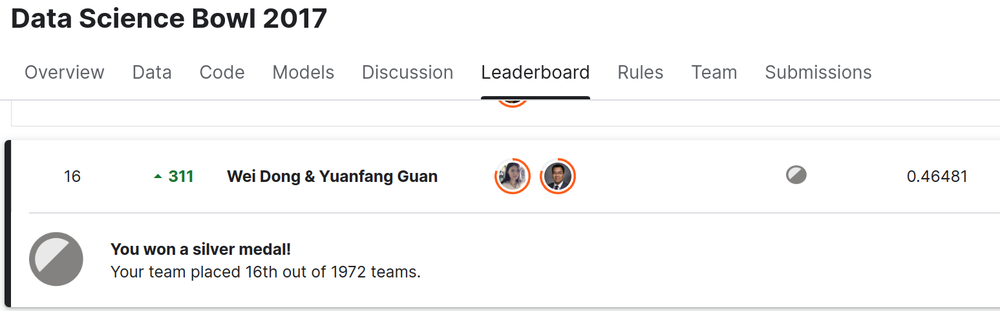

# Plumo: Lung Cancer Detector for Data Science Bowl 2017

Author: Wei Dong (wdong@wdong.org), Yuanfang Guan (yuanfang.guan@gmail.com)

https://www.kaggle.com/c/data-science-bowl-2017/leaderboard



This repository contains the dockerized version of my best
single (non-ensembled) lung cancer model for Data Science Bowl 2017
(cross validation loss around 0.425).

[Sample output](https://www.aaalgo.com/demos/plumo/plumo-example/)

You need nvidia-docker to run the program.

```
Usage:

./process.sh  input output

input: an input directory containing dicom files (input/*.dcm).
output: output directory where results (HTML) are written to.
```
Output format is designed to be viewed with a web browser on the local
machine.  Because the output contains all dicom files and a 3D lung mesh
model and is quite large, it is not suitable to be served on a web
server.

More models and training code are upcoming.


(Images and samples from the SPIE dataset.)
